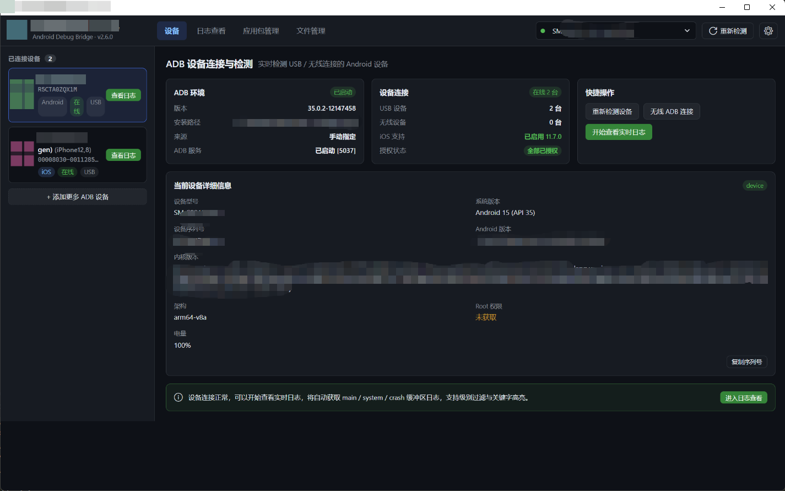
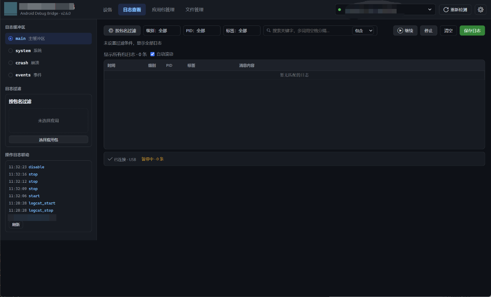
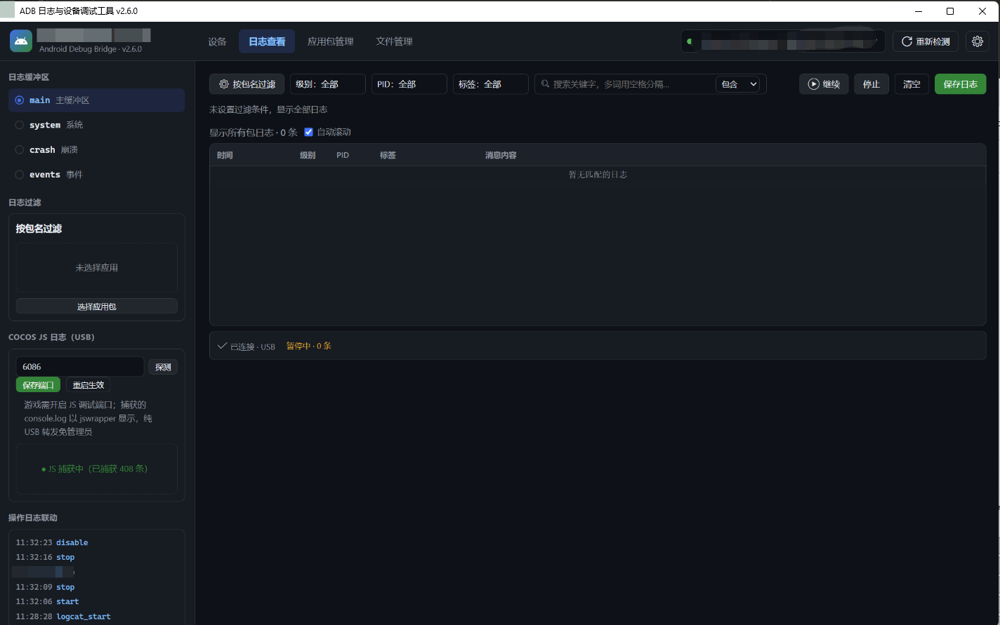
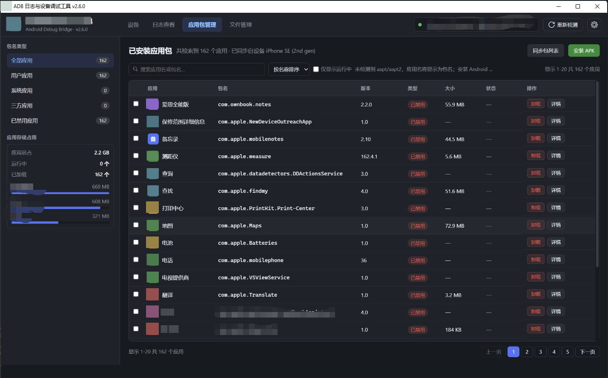
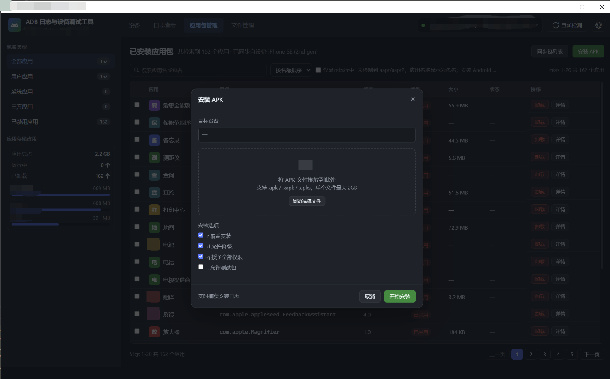
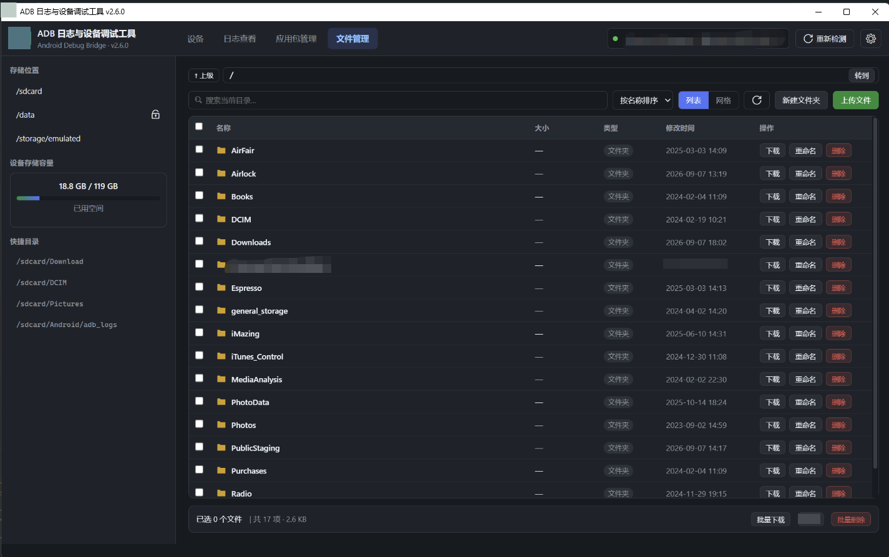
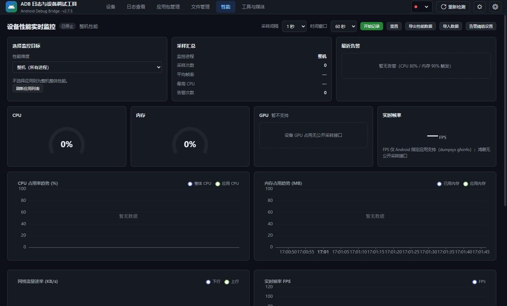
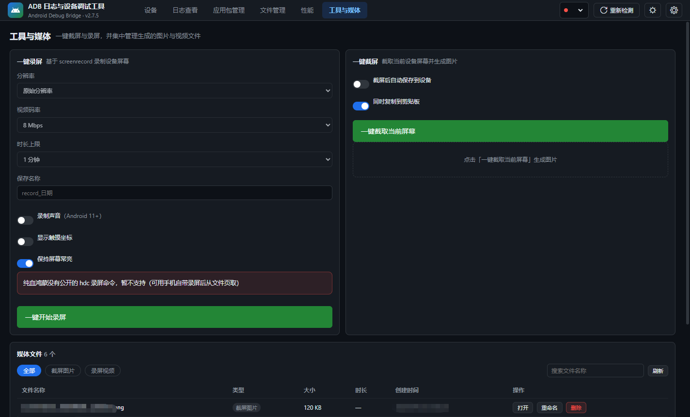

# ADB 日志与设备调试工具

支持 **Android（adb）**、**iOS（pymobiledevice3，可选）** 与 **鸿蒙（hdc）** 三平台：
设备管理 / 日志查看 / 应用包管理 / 文件管理 / 性能监控 / 工具与媒体 六大模块。

## 功能一览



**设备**
- Android / iOS 设备混列管理，USB 与无线 ADB（`adb connect`）一体
- ADB 环境自检（版本 / 路径来源 / server 状态 5037）、设备授权状态一目了然
- 设备详情：型号 / 系统版本 / 内核 / 架构 / Root 权限 / 电量，一键复制列号



**日志查看**
- Android：main / system / crash / events 四缓冲区实时流，内存环形 5 万行
- **鸿蒙（hdc）**：`hilog` 实时流接口对齐 logcat，前端轮询零改动；自动关闭隐私掩码
  （否则内容显示 `<private>`），tag 保留「域/标签」整体（如 `C01800/HLWF`）避免误过滤
- 筛选：按包名过滤、级别 / PID / 标签多选、多关键字（空格分隔 OR 匹配）、关键字高亮
- 暂停 / 继续 / 清空 / 保存日志；取消自动滚动 = 冻结当前视图安心阅读
- Cocos JS 日志（USB）：自动发现调试端口并连接，捕获游戏 console 输出（jswrapper）；
  「开启 INFO 日志 / VERBOSE」按钮经调试口动态打开引擎日志级别，无需重打包





**应用包管理**
- 全部 / 用户 / 系统 / 三方 / 已禁用分类，应用存储占用统计
- 安装 APK：拖拽或浏览，支持 `.apk / .xapk / .apks`（≤2GB），
  可选 `-r` 覆盖 / `-d` 降级 / `-g` 授权 / `-t` 测试包，实时抓取安装日志
- 卸载（含批量）、应用详情；iOS 设备应用列表同步展示





**文件管理**
- 快捷目录（/sdcard、/data、/storage/emulated）、设备存储容量统计
- 地址栏直达、列表 / 网格视图、排序、目录内搜索
- 上传 / 新建文件夹 / 下载 / 重命名 / 删除，批量下载与批量删除
- 私有目录（/data/data）自动 run-as 回退（debuggable 包）；鸿蒙走 hdc
  文件通道（`/storage/data/local`），目录不存在等错误给可读提示



**性能监控（Android / iOS / 鸿蒙）**
- **整机或指定应用**：监控目标下拉可切整机（所有进程）或某个应用（隐藏应用列表可选），
  采样间隔与时间窗口可调
- 仪表盘：CPU / 内存 / GPU / 实时帧率 FPS（GPU 与 FPS 受平台限制时如实标注，
  FPS 仅 Android 指定应用支持 `dumpsys gfxinfo`）
- 趋势曲线：CPU 占用（整体 / 应用）、内存占用（已用 / 应用）、网络速率（下行 / 上行）、FPS
- **告警**：CPU / 内存阈值可设置（默认 80% / 90%），触发即记录，仪表盘旁展示最近告警
- 开始记录 / 重置；性能数据导出 JSON、再导入回放
- iOS 走 DVT 仪器通道采样（CPU / 内存 / 电池 / 网络，非越狱；GPU counter 无公开接口），
  可导出 Instruments `.trace` 供 Xcode 深挖



**工具与媒体（一键截屏 / 录屏）**
- 一键截屏：Android `screencap` / 鸿蒙 `snapshot_display` / iOS DVT 截屏；
  可选截屏后自动保存到设备、随时复制到剪贴板
- 一键录屏：分辨率 / 码率 / 时长上限 / 保存名称可配，可选录制声音（Android 11+）
  与显示触摸坐标；停止走 SIGINT 优雅收尾，保证 MP4 可播放
- iOS 录屏：DVT 连续截屏帧实时落盘，停止后 ffmpeg 合成 MP4（中断自动保存已录部分），
  iOS 16 及以下可用，iOS 17+ 置灰并提示 AirPlay 备选；鸿蒙无公开 hdc 录屏命令，如实提示
- 媒体文件集中管理：截图 / 录屏分类筛选、时长探测（ffprobe）、搜索、分页浏览，
  打开 / 重命名 / 删除 / 另存为

## 运行

```bash
pip install -r requirements.txt
python main.py            # 或双击 run.bat
```

- Python 3.9+；Windows 需 WebView2 运行时（Win11 自带）。
- adb 按「设置页手动指定 → PATH → ANDROID_HOME → 随包便携版 → 常见路径」自动探测，
  未装也能启动（手动进入演示模式，不会静默回退假数据）。
- iOS 支持：`pip install pymobiledevice3`（Windows 需 iTunes/Apple 驱动提供 usbmux）。

## 打包

| 平台 | 命令 | 产物 |
| --- | --- | --- |
| Windows | `build_pyd.bat`（pyd 混淆 + onedir，需 MSVC） | `dist\adb_tool\`，**整目录分发** |
| macOS | `./build_mac.sh`（自建 venv，自动内置 adb） | `dist/device_bebugging_tool.app` + `device_bebugging_tool_macos_<arch>.zip` |
| macOS 免机器 | GitHub Actions → Build macOS App（可选 with_ios / dmg） | Artifacts 下载 |

- Windows 产物含 `fix_and_check.bat`：目标机首次解压后跑一次（解 MOTW + 查 .NET 4.7.2 + WebView2）。
- mac 产物首次打开右键 → 打开；网络下载的包若报「已损坏」执行
  `xattr -cr device_bebugging_tool.app`。
- iOS 支持打包时自动探测：构建环境装了 pymobiledevice3（`pip install pymobiledevice3`）
  就自动装入（约 +30MB），产物内嵌运行时目标机免 Python 环境；`WITH_IOS=0` 可强制
  出精简包，`WITH_IOS=1` 强制装入（环境缺依赖会直接报错）。

### 发版（push main 或打 tag 自动出双平台包）

版本号自动递增，**不用手改** `core/api.py`：push main 时取最新 `v*` tag 的 patch +1
（v2.7.4 → v2.7.5），手动打 tag 则直接用 tag 本身。窗口标题 / 界面显示的版本 /
产物名 / tag / Release 标题全部同源；本地源码运行与 pyd 打包也按同款规则显示
「下一个版本」（上一个发布 v2.7.4 -> 本地显示 2.7.5）。

```bash
# 日常：改动 push 到 main，自动算版本、出双平台包并挂到 GitHub Releases
git push origin main

# 正式发版：手动打 tag（不递增，直接用 tag 本身）
git tag v2.8.0 && git push origin v2.8.0
```

产物：`device_bebugging_tool_v<版本>_win64.zip`、`..._macos_arm64.zip|.dmg`、
`..._macos_x86_64.zip|.dmg`（Windows 包与 mac 包都已内置 adb，目标机免装 Android SDK）。

> **鸿蒙 hdc**：打包机制与 adb 不同——hdc 没有稳定直链可自动下载，属于**可选内置**：
> 打包前把 `hdc`（Windows 为 `hdc.exe`）放到 `../public_settings/hdc/`（或
> `build/_portable_hdc/`），打包脚本会自动拷进产物 `public_settings/hdc/`；
> 没放则只提示不报错，鸿蒙功能需目标机自备 hdc（DevEco Studio / OpenHarmony SDK
> 自带，或放到产物同目录）。`hdc.py`/`hilog.py` 支持代码本身在 Windows/macOS
> 包里都会带上。

> 源码运行（`run.bat`）时显示的版本号取「最新 tag 的 patch+1」（v2.7.4 → 显示
> 2.7.5），与下一次发布版本一致；正式发版打 tag 时 CI 直接用 tag 本身。

## 目录结构

```
main.py                 入口转发（3 行，无业务逻辑）
core/
  app.py                启动流程（HTTP Server + 窗口 + 控制台噪音过滤）
  adb.py / ios.py / hdc.py    adb / iOS（常驻 asyncio 线程）/ 鸿蒙 hdc 封装
  logcat.py / ioslog.py / hilog.py   三平台日志会话（输出统一为同一种行结构）
  perf.py / ios_perf.py 性能采样（整机 / 指定应用）与 iOS DVT 仪器通道
  media.py              一键截屏 / 录屏与媒体文件管理（三平台分流）
  api.py                js_api 层（业务方法 + 长任务 Task 机制，按 platform 分发）
  demo.py               演示数据（显式开启，不自动回退）
  labels.py / zhdict.py 应用名解析 / 中文词库懒加载
config/                 权限中文（368 条）+ 包名中文（654 条，含鸿蒙 NEXT 实测包名）
web/                    index.html + css + js + vendor 本地化依赖
build_pyd.bat / adb_tool.spec / pyd_pack.py          Windows 打包
build_mac.sh / .github/workflows/build-mac.yml       macOS 打包
build_mac_win.bat       源码 zip / 触发云端构建
_dom_check.js 等        离线回归脚本（见下）
```

## 关键约定

- **实时日志**：后端子进程/流式入库，前端自适应轮询（有新日志 400ms，空闲 2s）；
  内存环形上限 5 万行；暂停只停渲染，恢复一次性补齐。
- **Cocos JS 捕获（iOS）**：usbmux 端口转发 + CDP 捕获 console，纯 USB 免管理员；
  调试端口自动发现（开始捕获即连接，无需手动重启），游戏重启自动重连
  （多候选地址依次握手）；「开启 INFO 日志」按钮经调试口执行
  `cc.debug._resetDebugSetting(DebugMode.INFO)`，无需重打包。
- **长任务**：push/pull/install/uninstall 全部返回 taskId，前端 300ms 轮询，可取消；
  安装进度靠 push 后按目标端 stat 计算速率；`.xapk/.apks` 走 install-create 会话。
- **下载**：不用 `adb pull`（Windows 下中文/空格路径会坏），统一 `exec-out cat / tar` 流式下载；
  私有目录自动 run-as 回退（debuggable 包）。
- **目录列举**：`ls -la` 路径必须带尾斜杠（符号链接只返回链接本身）；
  hdc 的 shell 失败也返回 exit 0，`ls` 错误行会混在 stdout，解析前先按条目格式过滤。
- **录屏收尾**：停止不能强杀进程——Android 对 screenrecord 发 SIGINT 让它写完 MP4 封包；
  iOS 是 DVT 连续截屏帧实时落盘，停止后 ffmpeg 合成，中断也能保存已录部分。
- **多设备**：所有命令强制 `-s <serial>` / `-t <key>`；顶栏切换设备后各模块会话重置。
- **应用名**：静态中文词库优先 → aapt 解析（按 serial:pkg 缓存）→ 包名兜底；
  词库缺失不报错。前缀兜底默认关闭（会把大量包归成同名）。
- **危险操作**：二次确认 + 输入 DELETE + 操作日志联动。

## 验证（无需真机即可跑大部分）

```bash
node _dom_check.js            # jsdom 渲染+交互冒烟，99 项
python _backend_check.py      # 后端自测（真机+演示模式双跑，按平台分流）
python _mac_dryrun_check.py   # Windows 上模拟 darwin 预检 mac 打包分支
python _render_check.py       # 真实窗口渲染冒烟（需桌面会话）
```
## 下载安装包
- **GitHub Releases：** https://github.com/carterking888/phone_log_tool/releases

## 平台差异速查

| | Windows | macOS |
| --- | --- | --- |
| 渲染后端 | WebView2 + pythonnet（需 .NET 4.7.2+） | Cocoa / WKWebView（无需 .NET） |
| Cython 产物 | `core/*.pyd` | `core/*.so` |
| 打包形态 | onedir（exe + `_internal`） | `.app` bundle + ad-hoc 签名 |
| adb 来源 | 便携目录 / PATH / SDK | 包内 `Contents/MacOS/public_settings/adb`（构建时自动下载） |

PyInstaller 不支持交叉编译：mac 产物必须在 macOS 或 GitHub Actions 上构建。
