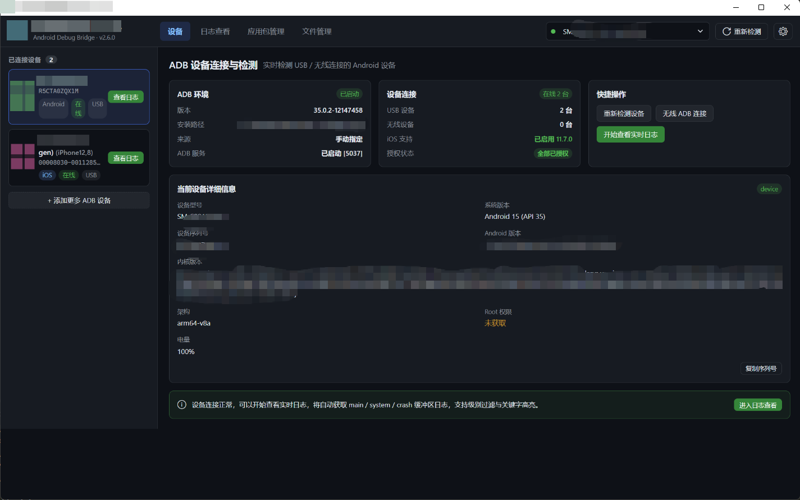
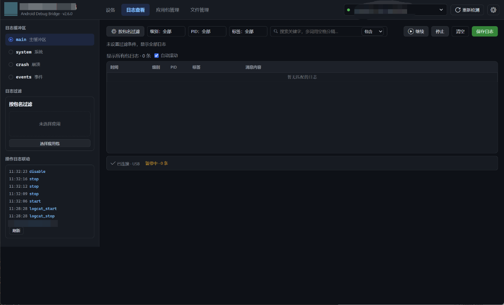
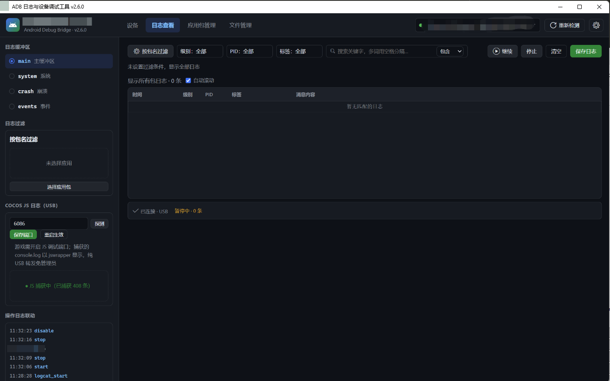
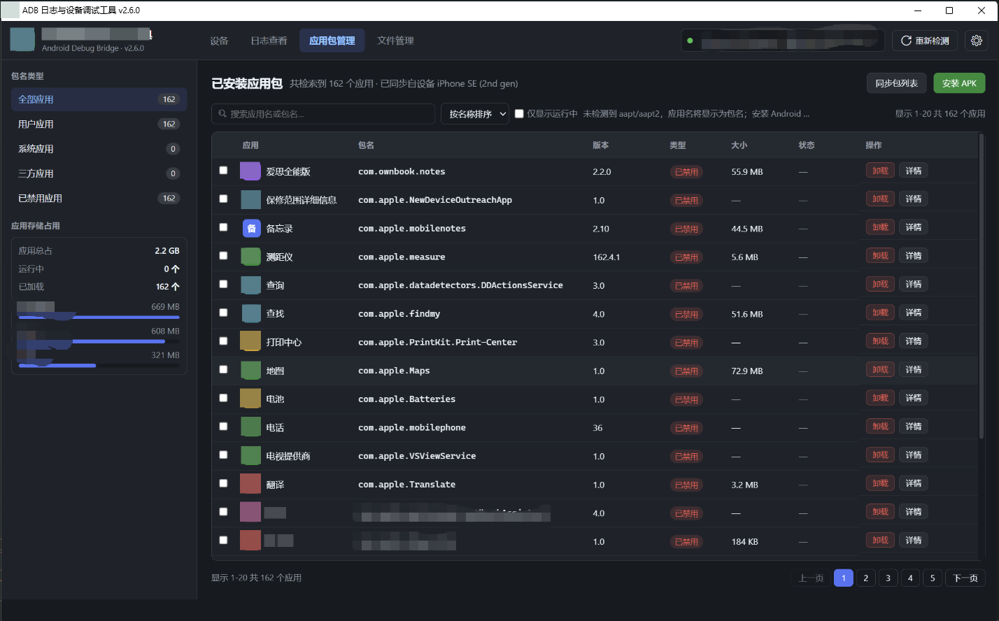
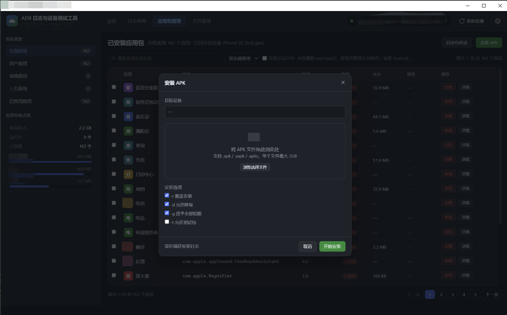
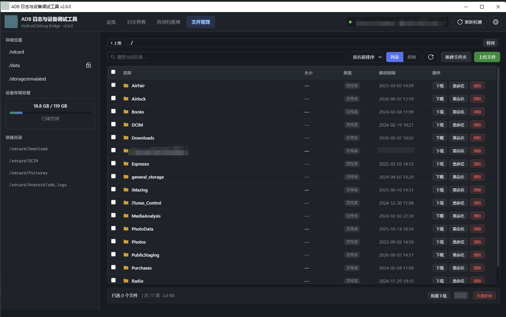

# 我用 Python 写了个 Android / iOS 双平台日志调试工具，抓日志再也不用敲命令了

> 做安卓/iOS 测试或开发的同学大概都有这种体验：排查问题时要一边敲 `adb logcat`、`adb shell`、`ls`、`pull`，一边在几十万行日志里翻关键字，换台设备还得重新来一遍。Windows 下 `adb pull` 遇到中文路径还会悄悄丢文件。
>
> 于是我用业余时间写了这个**桌面端 ADB / iOS 日志与设备调试工具**：连上手机点几下，日志、应用、文件全都能可视化操作。本文分享功能设计和几个踩坑点，源码结构也一并放出。

## 整体架构

技术栈选型一句话：**pywebview（壳）+ 原生 HTML/JS（界面）+ Python（内核）**。

- 界面：LayUI 2.9 + Petite-Vue，深色主题，全部依赖本地化，打包后不依赖网络
- 内核：adb 封装 + pymobiledevice3（iOS），日志会话统一成同一种行结构，前端一套表格通吃双平台
- 打包：Windows 走 Cython pyd 混淆 + PyInstaller onedir；macOS 走 `.app` bundle + GitHub Actions 云端构建

选 pywebview 而不是 Electron 的理由：包体小（30MB 级）、能直接复用 Python 生态（adb / pymobiledevice3 都是现成的），代价是要自己解决 JS 与 Python 的通信和线程问题——这也是后面踩坑最多的地方。

## 功能亮点

### 1. 设备管理：Android / iOS 同框

- USB + 无线 ADB 一体管理，设备授权状态、ADB 环境自检（版本/来源/server 5037）一眼看清
- 设备详情：型号、系统版本、内核、架构、Root 权限、电量，一键复制列号
- iOS 通过 pymobiledevice3 接入（Windows 装 iTunes 驱动提供 usbmux 即可，免越狱）

### 2. 日志查看：筛选要够快、够细

- main / system / crash / events 四缓冲区实时流，内存环形缓冲 5 万行
- **多选筛选**：级别 / PID / 标签都是多选面板；**多关键字搜索**：空格分隔、任一命中即显示，命中高亮
- 暂停只停渲染不停采集，恢复一次性补齐；取消自动滚动 = 冻结当前视图，翻历史日志不怕被新日志顶走
- 一键保存日志，操作留痕（start/stop/clear 都有操作日志联动）

### 3. Cocos 游戏的 JS 日志：不用连 Safari 也能抓

这是我最想做的功能。Cocos 游戏的 `console.log` 在系统日志里默认被吞，常规做法是 Mac 上连 Safari Web Inspector 抓。这个工具的做法：

1. USB 连接后**自动扫描**设备侧的 V8 Inspector 调试端口（6086 等）
2. usbmux 端口转发到本地，走 Chrome DevTools Protocol 捕获 console 输出
3. 游戏重启自动重连（多候选地址依次握手，旧的 target id 失效就换下一个）
4. 更进一步：**「开启 INFO 日志」按钮**通过调试口在游戏里远程执行 `cc.debug._resetDebugSetting(cc.debug.DebugMode.INFO)`，把被默认级别吞掉的日志动态打开——不用重打包游戏

全程纯 USB、免管理员、免 Mac。

### 4. 应用包管理：拖个 APK 就装

- 应用列表按全部 / 用户 / 系统 / 三方 / 已禁用分类，存储占用统计
- **安装 APK 支持拖拽**：`.apk / .xapk / .apks` 都行（最大 2GB），覆盖 / 降级 / 授权 / 测试包四个 adb 选项可视化勾选，安装过程实时抓日志
- 卸载支持批量；iOS 设备的应用列表也能同步展示

### 5. 文件管理：绕开 adb pull 的坑

- 快捷目录直达，设备存储容量可视化，地址栏直接输路径跳转
- 列表 / 网格两种视图，上传 / 新建 / 重命名 / 删除 / 批量下载
- **私有目录（/data/data）自动 run-as 回退**：debuggable 包不用 Root 就能浏览和下载
- 下载全部走 `adb exec-out cat / tar` 流式写本地文件——这是踩坑换来的设计，见下文

## 踩坑记录（都是真机实测换来的）

**① `adb pull` 在 Windows 下不可靠。** 中文远程路径会丢扩展名、带空格直接失败。所以所有下载统一走 `adb exec-out` 流式输出，目录用 `tar -cf -` 打包流式接收，字节级一致。

**② `ls -la` 路径必须带尾斜杠。** `/sdcard` 是符号链接，不带斜杠只返回链接本身，永远列不出内容。

**③ pywebview 的 js_api 跑在后台线程。** 每次调用都新建线程，高频轮询会产生大量线程和跨线程 COM 噪音——所以前端轮询做了自适应降频：有新日志 400ms 一拉，空闲降到 2s。

**④ WebView2 不给 JS 真实拖拽路径。** 拖 APK 安装时 JS 拿到的只有文件名，必须 hook 原生 `NavigationStarting` / `DownloadStarting` 事件才能拿到完整路径，而且 CLR 属性访问必须回 UI 线程，否则静默硬崩。

**⑤ Petite-Vue 的渲染期表达式严禁引用未挂载的全局。** 首渲染抛一次 ReferenceError，对应指令的 effect 就永久失效——区块从此消失且不报错，排查了很久。

**⑥ PyInstaller 6 的 macOS BUNDLE 会重排目录。** 可执行文件在 `Contents/MacOS`、二进制在 `Contents/Frameworks`、数据文件在 `Contents/Resources`，和 Windows 的 `_internal` 布局完全不同，校验脚本必须全 bundle 递归找。

**⑦ 演示模式必须显式开启。** 早期版本"检测不到设备就自动进演示模式"，结果假设备数据误导了好几次排查。后来改成：空设备就显示空列表，想看演示手动点。

## 验证与分发

- jsdom 离线回归：`node _dom_check.js`（渲染 + 交互冒烟，99 项，无需真机）
- 后端自测：`python _backend_check.py`（真机 + 演示模式双跑）
- Windows 打包：Cython 编译 core 为 pyd + PyInstaller + UPX，附 `fix_and_check.bat` 处理目标机环境自检
- macOS 打包：`build_mac.sh` 自动建 venv、内置 adb 到包内，GitHub Actions 云端出包（Windows 无法交叉编译 mac 产物）

## 写在最后

这个工具的核心思路是：**把高频、繁琐、易错的命令行操作收敛成点几下按钮，同时把坑在代码层面堵死**（下载绕开 adb pull、私有目录自动 run-as、日志洪流后端预过滤）。

目前支持 Android 全量功能，iOS 覆盖日志 / 应用 / 文件（媒体域），后续计划把 iOS 文件管理补齐到沙盒域。

如果你也在做类似的工具，欢迎交流；觉得有用的话点个赞收藏，回头翻出来不亏。

---

*关键词：ADB、logcat、pymobiledevice3、pywebview、Cocos、日志抓取、桌面工具*
